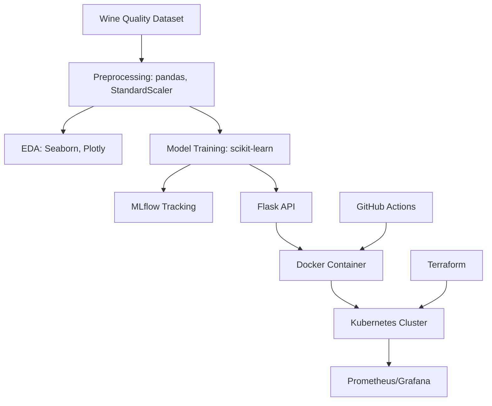
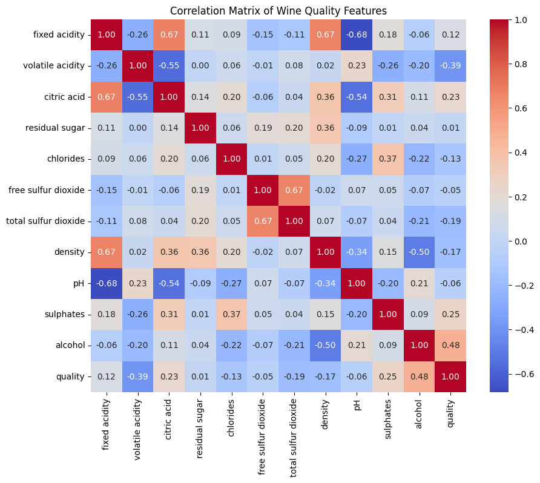
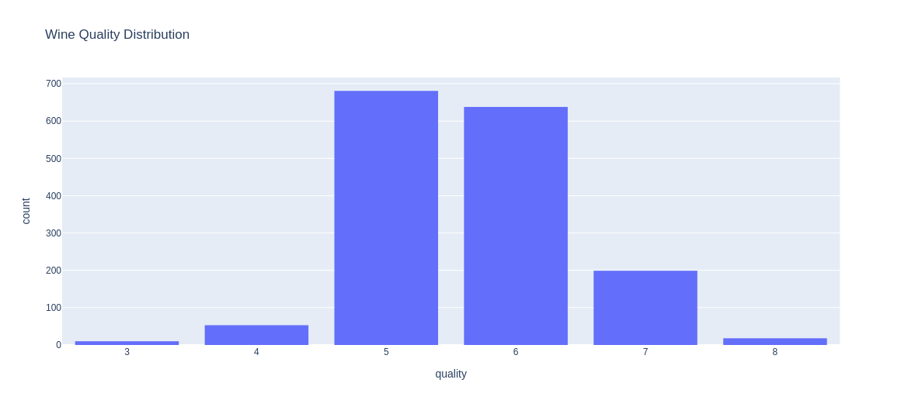
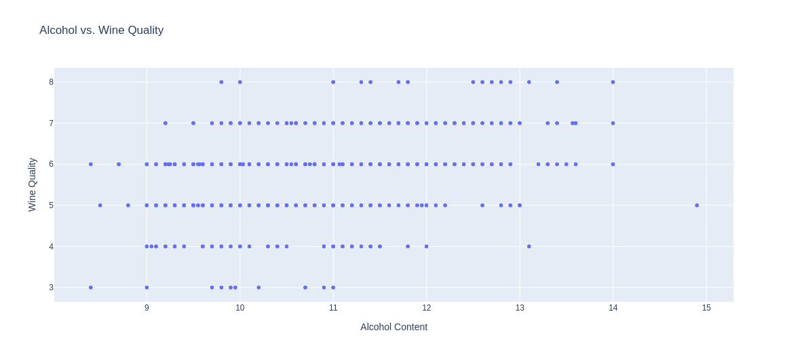
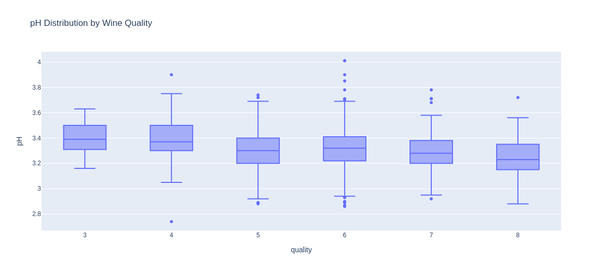

# Wine Quality MLOps Pipeline


An end-to-end MLOps pipeline for predicting wine quality, blending Data Science and DevOps. This project preprocesses the [UCI Wine Quality dataset](https://archive.ics.uci.edu/ml/datasets/wine+quality), trains a machine learning model, deploys it as an API on Kubernetes, provisions infrastructure with Terraform, and monitors performance with Prometheus/Grafana.

### 🚀 Overview
This project demonstrates a scalable MLOps workflow:
- **Completed**: Exploratory Data Analysis (EDA) and preprocessing using Google Colab, with visualizations of key insights.
- **In Progress**:
  - Train a Random Forest model with scikit-learn and track experiments with MLflow.
  - Deploy a Flask API using Docker and Kubernetes.
  - Provision an AWS EKS cluster with Terraform.
  - Monitor API performance with Prometheus and Grafana.

### 🛠️ Technologies
- **Data Science**: Python (3.9), pandas (2.2.2), scikit-learn (1.6.0), Seaborn (0.13.2), Plotly (5.24.1), MLflow, Jupyter (Google Colab)
- **DevOps**: Docker, Kubernetes, Terraform, GitHub Actions
- **Monitoring**: Prometheus, Grafana

### 📈 Architecture



Getting Started
Clone the repo:bash
1. Clone the repo:

```bash
git clone https://github.com/trinidadgithub/DataScience.git
cd wine-quality-mlops
```

2. View the EDA notebook:
Google Colab Link (your-colab-link)
3. Set up a virtual environment (optional for local development):
```bash
python3 -m venv venv
source venv/bin/activate
pip install -r requirements.txt
```
4.  Run the notebook locally (optional):
```bash
jupyter notebook notebooks/explore.ipynb
```

5.  jupyter notebook notebooks/explore.ipynb
```bash
python src/train.py
```

## 📊 EDA Visualizations
### Correlation Matrix

*Shows feature relationships, e.g., alcohol and volatile acidity’s impact on quality.*

### Quality Distribution

*Histogram of wine quality scores, showing most wines score 5–6.*

### Alcohol vs. Quality

*Scatter plot highlighting alcohol’s positive correlation with quality.*

### pH Distribution

*Box plot showing pH distribution across quality scores.*

***Blog Post***

***Read about my EDA process and pipeline progress on my WordPress blog!***

ContactGitHub: trinidadgithub 

LinkedIn: Your LinkedIn 

#### 📄 License
[MIT License](./LICENSE)

 
