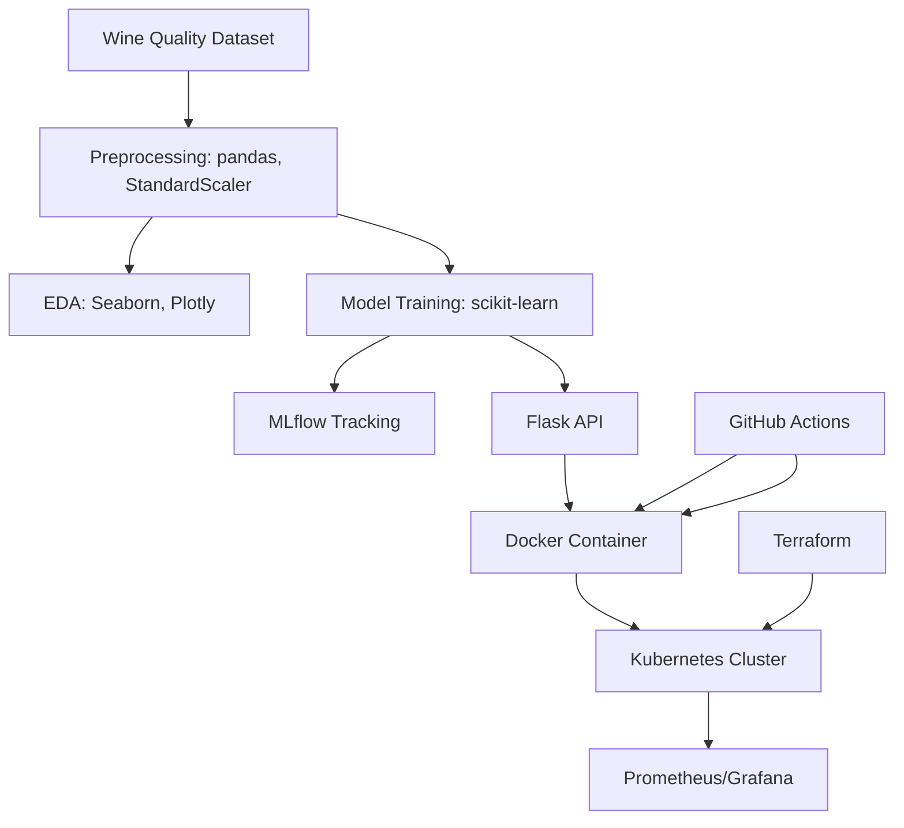

# Wine Quality MLOps Pipeline

An end-to-end MLOps pipeline for predicting wine quality, integrating Data Science with DevOps. Built with Python,
##
Overview
This project (in progress) will:
- Explore and preprocess the [UCI Wine Quality dataset](https://archive.ics.uci.edu/ml/datasets/wine+quality)
- Train a model with scikit-learn and MLflow.
- Deploy a Flask API on Kubernetes.
- Provision infrastructure with Terraform.
- Monitor with Prometheus/Grafana.
Technologies
##
- Data Science: Python, pandas, scikit-learn, MLflow, Jupyter (Google Colab)
- DevOps: Docker, Kubernetes, Terraform, GitHub Actions
- Monitoring: Prometheus, Grafana
##
Architecture

Getting Started
�. Clone the repo: git clone https://github.com/trinidadgithub/DataScience.git
�. View the EDA notebook: Google Colab Link (https://colab.research.google.com/drive/15_UCibwPZRopXiBSqgagXUcnof3xLBzU?usp=sharing)
�. (Upcoming) Install dependencies: pip install -r requirements.txt
Blog Post
Follow my progress on my WordPress blog!

Contact
• GitHub: trinidadgithub
• LinkedIn: Your LinkedIn

License
MIT License

